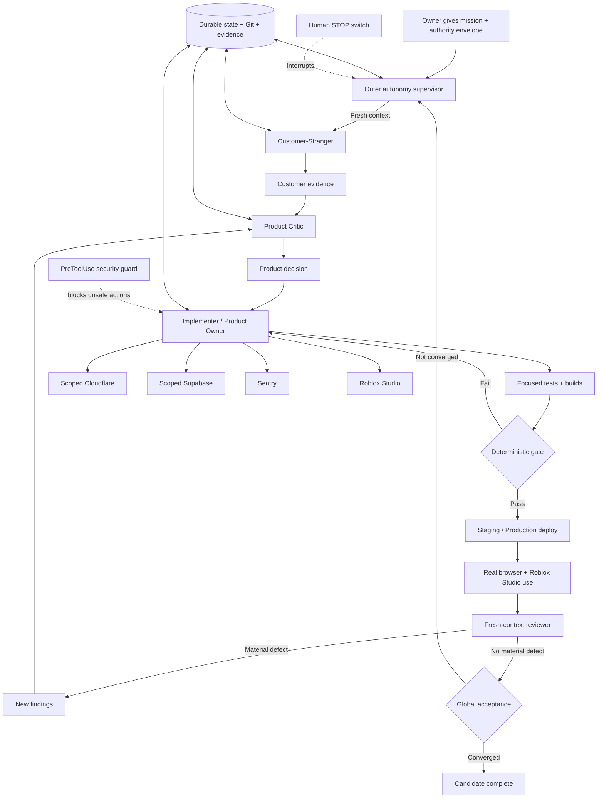
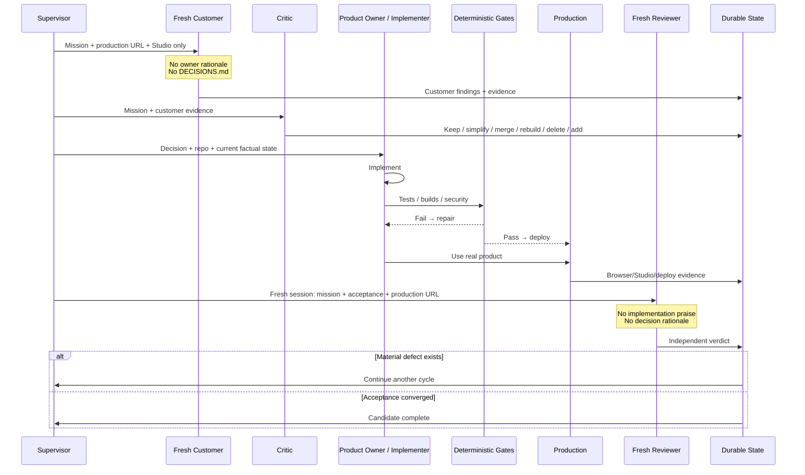

# Autonomous Product Ownership for Apple: A Sourced, Operational Claude/WorkBuddy Harness

## Executive Summary

The strongest version of the workflow you described is **not a single “never stop” prompt**. The reliable architecture is a layered autonomous-agent harness in which Claude receives broad **product authority**, but the operating system, agent runtime, credentials, deployment tooling, and deterministic hooks continue to impose hard safety boundaries.

Anthropic’s own long-running-agent research reaches essentially the same architectural conclusion: work lasting hours or days must survive context-window turnover through durable artifacts, incremental progress, verification, and fresh sessions rather than attempting to preserve one enormous conversation indefinitely. Anthropic’s published harness used an initializer, persistent progress artifacts, Git history, and successive coding sessions that re-read the current state. citeturn23search7turn14search8

The recommended architecture for Apple is therefore:

**Autonomous Product Owner prompt → outer supervisor → fresh agent session → customer/critic/implementer phase → deterministic gates → deployment → real browser/Studio usage → fresh-context reviewer → durable handoff → fresh session → repeat.**

Anthropic’s official Ralph Loop is valuable, but it should be an **inner implementation loop**, not the top-level Product Owner. Ralph deliberately feeds the same task back through a `Stop` hook until a completion condition or iteration ceiling is reached; its own documentation warns that this technique fits tasks with objective completion criteria better than open-ended design judgment. citeturn15view0turn15view1 Real issues in the official plugin repository also show why it should not be your only persistence mechanism: reported failures have included missing executable permissions on macOS and cross-session state races. citeturn23search0turn23search5

The best design is therefore a **hybrid**:

| Layer | Responsibility |
|---|---|
| Outer supervisor | Starts fresh sessions, enforces wall-clock/session/failure ceilings, checks the emergency stop, respawns after crashes, and rotates between customer, critic, implementer, and reviewer roles. |
| Durable state | Small factual files on disk, Git commits, evidence artifacts, deployment IDs, screenshots, test results, and a compact handoff. |
| Claude/WorkBuddy agent | Makes product and engineering decisions autonomously. |
| Ralph/Stop loop | Optionally keeps a bounded implementation/test task running until deterministic gates pass. |
| Hooks / sandbox / permission rules | Enforce actions that must remain impossible regardless of what the prompt says. |
| Scoped credentials | Give the agent the authority needed for Apple without granting unnecessary authority over the rest of your accounts/computer. |
| Fresh reviewer | Experiences production without the implementation rationale and is not allowed to rubber-stamp the builder. |
| Human hard stop | Reserved for MFA/passkeys, financial/legal authority, new privilege grants, genuinely irreversible external actions, or security incidents. |

The distinction that matters most is:

> **Full product authority is not the same thing as unrestricted security-principal authority.**

Claude can legitimately decide that a feature should be removed, redesign the entire workflow, replace architecture, edit/delete project files, run tests, control Roblox Studio, deploy an already-authorized release, change the database through an approved migration path, and choose development tools **without asking you for product decisions**. It should *not* be given technical permission to dump browser cookies, scrape Keychain, steal credentials, bypass MFA, exfiltrate files to arbitrary domains, make purchases, agree to legal terms, or erase production databases without a recovery path. Anthropic and WorkBuddy both support permission models in which unattended work can proceed through explicit allow/deny rules while hooks remain able to block actions even when the agent otherwise has broad authority. citeturn9search0turn10view0turn11search2turn11search6

This is especially important on your current machine. The WorkBuddy handoff records a functioning Cloudflare MCP under `~/.workbuddy-ai/mcp.json`, but it was authorized with the entire offered scope set and demonstrated real write authority. That was useful to prove the connection, but it is **too broad to be the ideal credential for a multi-day unattended owner**. The same handoff also records that the repository was still heavily dirty and nothing from that session had been pushed. fileciteturn0file0 Before entering the autonomous-product-owner phase, the current Claude release session should establish a recoverable baseline and finish reconciling that state.

There is another reason to insist on independent fresh review. The main handoff characterized the AI Elements requirement as largely satisfied, while the dedicated surface audit found that only `Reasoning` among the explicitly targeted `Conversation`, `Message`, `PromptInput`, `Sources`, `Reasoning`, `ChainOfThought`, `Tool`, and `Task` components was actually present; the rest of the visible chat remained AICSS or local implementation. fileciteturn0file6 That discrepancy is a concrete example of why **the same agent that implemented something must not be the sole authority deciding that it satisfies the product requirement**.

The target architecture is:



## Evidence Base and Design Principles

The patterns below are not based on one anecdotal “autonomous Claude” setup. Each is supported by at least five primary or near-primary sources.

| Pattern | Primary/authoritative evidence | Operational conclusion |
|---|---|---|
| **Long-running harnesses** | Anthropic, *Effective harnesses for long-running agents*. citeturn23search7 Anthropic official Ralph Loop README. citeturn15view0 Ralph Stop-hook implementation. citeturn15view1 Anthropic’s multi-agent C-compiler case study. citeturn1search10 Claude Agent SDK/CLI session tooling. citeturn9search7 Claude Routines for unattended executions. citeturn22search7 | Persistence must live outside one model context. A process/harness owns lifetime; an agent owns work within a session. |
| **Durable persistence** | Anthropic long-running harness research. citeturn23search7 Anthropic context-engineering guidance. citeturn14search8 Claude project-memory system. citeturn17view2 Claude checkpointing. citeturn10view3 WorkBuddy subagent persistent memory. citeturn11search7 Long-horizon memory research. citeturn14academia26turn14academia27 | Keep facts, decisions, Git state and evidence on disk; do not make transcript length your persistence strategy. |
| **Fresh-context handoff** | Anthropic’s initializer/coding-agent shift model. citeturn23search7 Anthropic context compaction/note-taking guidance. citeturn14search8 Claude subagents use isolated context. citeturn21search5 Claude Agent Teams create independent agent contexts. citeturn17view1 Anthropic managed-agent architecture. citeturn1search7 WorkBuddy subagents support isolated tools/permissions/memory. citeturn11search7 | Rotate agents intentionally. Pass compact facts and next actions, not a 600-message transcript. Reviewers should receive less context than implementers. |
| **Permission models** | Claude Agent SDK permission resolution. citeturn9search0 Claude Code IAM/permission modes. citeturn8search13 Claude deterministic hooks. citeturn10view0 WorkBuddy permission modes. citeturn11search2 WorkBuddy OS-level Bash sandboxing. citeturn11search6 WorkBuddy permission/settings precedence. citeturn11search10 | Put non-negotiable rules in hooks/sandbox/credential scopes, not only in English instructions. |
| **Credential management** | Cloudflare granular API-token permissions. citeturn13search2 Cloudflare token IP/TTL restrictions. citeturn13search12 Cloudflare Workers secrets guidance. citeturn13search17turn13search7 Supabase scoped personal-access-token guidance. citeturn7search9 Supabase CLI native credential storage. citeturn7search4 GitHub Actions OIDC short-lived credentials. citeturn18view4 Sentry scoped CI permissions. citeturn22search13 | Prefer service-specific, scoped and revocable authority. Never put secret values in prompts, Git, logs, evidence or handoffs. |
| **OAuth and MCP bridging** | MCP authorization specification. citeturn12view3 MCP Streamable HTTP transport. citeturn12view2 MCP security best practices. citeturn12view4 Cloudflare’s API MCP documentation. citeturn3search1turn3search10 RFC 8252 native-app loopback redirects. citeturn3search3 `mcp-remote` primary repository. citeturn12view0 WorkBuddy MCP/OAuth documentation. citeturn11search1 | `mcp-remote` is a compatibility bridge, not a security boundary. Bind OAuth callbacks to loopback; scope credentials independently of the bridge. |
| **Deployment safety** | Cloudflare gradual deployments. citeturn18view1 Cloudflare Workers rollback. citeturn18view0 GitHub deployment environments/protection. citeturn18view3 GitHub OIDC. citeturn18view4 Supabase branching. citeturn19view1 Supabase migration workflow. citeturn19view0 Supabase backups. citeturn19view3 Sentry release/deploy tracking. citeturn22search3 | Build → test → deploy through known scripts → fetch production back → monitor → retain rollback/restore path. |
| **Human-in-the-loop hard stops** | Claude PreToolUse/Stop hooks. citeturn10view0 Claude `dontAsk`/deny/bypass semantics. citeturn9search0 Ralph maximum-iteration ceiling. citeturn15view0 WorkBuddy’s warnings around Full Access. citeturn11search2 GitHub required deployment reviewers. citeturn18view3 Claude Routines’ recommendation to constrain repository/network/environment reach. citeturn22search7 | “Autonomous” means no routine product-management approvals, not removal of every external safety interlock. |

The evidence leads to several design principles.

**A prompt cannot enforce a security boundary against an agent that has unrestricted OS credentials.** Anthropic explicitly separates model instructions from deterministic hooks and permission rules; WorkBuddy similarly exposes permission modes and sandboxing because model-level intentions alone are not sufficient enforcement. citeturn9search4turn10view0turn11search6 Therefore the correct goal is **maximum legitimate product authority inside a constrained security envelope**, not “give the model every secret on the Mac.”

**Fresh context is a feature, not a failure.** Anthropic’s long-running harness treats successive context windows much like engineering shifts: the incoming agent reads durable progress artifacts and Git state, then makes incremental progress. Context engineering guidance likewise recommends structured external notes and compaction rather than accumulating everything forever. citeturn23search7turn14search8

**Ralph is useful but insufficient as the top-level owner.** The official implementation works by intercepting `Stop` and feeding the task back, with persisted loop state and an iteration ceiling. Its README explicitly frames it around objective completion, while your Apple task contains subjective product discovery, customer judgment, fresh-context criticism, browser experience and architecture reconsideration. citeturn15view0turn15view1 The official issue tracker also contains concrete operational failure reports, including macOS execution-permission failures and a race involving multiple sessions sharing the state file. citeturn23search0turn23search5

**Autonomous production operation should be credential-scoped rather than trust-scoped.** Cloudflare supports granular account/zone permissions and restrictions such as validity windows/IP constraints; Supabase distinguishes scoped automation credentials from high-privilege keys; GitHub OIDC avoids persisting long-lived cloud credentials in CI. citeturn13search2turn13search12turn7search9turn18view4

**The browser and Studio are part of the test system.** Anthropic’s long-running-agent research notes the importance of end-to-end verification rather than allowing agents to infer completion from code alone. citeturn23search7 That lesson is directly applicable to Apple: the current evidence package says the previous browser sweep did not exercise the authenticated workspace, and the Studio acceptance did not exercise the paired model→tool→Studio mutation loop. fileciteturn0file2 fileciteturn0file3

## Recommended Harness Architecture

The recommended implementation is an **outer supervisor with fresh processes**, plus an **optional bounded Ralph loop for deterministic implementation subproblems**.

### Harness comparison

| Harness | Strengths | Weaknesses | Appropriate Apple role | Verdict |
|---|---|---|---|---|
| **Ralph Stop-hook alone** | Very little infrastructure; persists work through files/Git; prevents casual early exit; explicit max iterations and completion promise. citeturn15view0turn15view1 | Same broad task keeps returning into the same session; not naturally a fresh-context product review; official docs caution against judgment-heavy tasks; plugin operational issues have occurred. citeturn15view0turn23search0turn23search5 | Focused “fix until test X is green” or “implement this decision and pass these gates.” | **Use as inner loop only.** |
| **Cron + state files** | Simple; naturally restarts fresh processes; survives terminal exit; good for periodic audits. | Time-driven rather than state-driven; overlapping jobs/locks require care; slow response to completed work; poor interactive Studio orchestration. | Nightly Sentry/security/production audits or watchdog. | **Useful secondary watchdog.** |
| **Long-lived supervisor + fresh agent children** | Explicit lifecycle, retries, timeouts, phase rotation, fresh contexts, locks, hard-stop switch, evidence handling and reviewer separation. | Requires a small amount of engineering; supervisor itself must be tested. | Main product-ownership harness. | **Recommended.** |
| **Claude Routines / managed cloud execution** | Vendor-managed scheduling, unattended sessions and bounded external reach. citeturn22search7turn21search3 | Runs in managed cloud; therefore it cannot directly drive the local Roblox Studio session on Moshe’s Mac without another bridge. This is an inference from the execution architecture. citeturn22search7 | Cloud-only audits, GitHub maintenance, periodic reviews. | **Supplement, not primary.** |

### Durable directory layout

Use the known project root:

```text
/Users/moshe/Desktop/RbxAI
```

Create the following. These are **proposed harness paths**, not existing project facts:

```text
/Users/moshe/Desktop/RbxAI/
├── .autonomy/
│   ├── state.json
│   ├── result.json
│   ├── STOP
│   ├── runner.pid
│   ├── supervisor.log
│   ├── sessions/
│   ├── locks/
│   └── backups/
│
├── docs/autonomy/
│   ├── MISSION.md
│   ├── CUSTOMER_FINDINGS.md
│   ├── PRODUCT_HYPOTHESES.md
│   ├── DECISIONS.md
│   ├── EXPERIMENTS.md
│   ├── CURRENT_STATE.md
│   ├── NEXT_ACTION.md
│   ├── ACCEPTANCE.json
│   ├── HANDOFF.md
│   └── evidence/
│       └── YYYY-MM-DDTHHMMSSZ/
│
└── scripts/
    ├── autonomy-supervisor.py
    ├── autonomy-gate.sh
    └── autonomy-review-gate.py
```

`.autonomy/` is runtime state and should normally be excluded from Git except for a documented schema/example. `docs/autonomy/` is durable project knowledge and should be committed when its contents are appropriate for the repository. Never put credentials in either location.

A minimal initial state is:

```json
{
  "schema": 1,
  "status": "running",
  "phase": "customer-stranger",
  "iteration": 0,
  "started_at": null,
  "last_session_started_at": null,
  "last_session_finished_at": null,
  "consecutive_failures": 0,
  "max_consecutive_failures": 3,
  "max_sessions": 80,
  "max_wall_clock_hours": 72,
  "candidate_complete": false,
  "fresh_reviews_without_material_blocker": 0,
  "human_blocker": null
}
```

The values `80` and `72` are recommended starting ceilings, not vendor requirements. They ensure that “work for days” does not accidentally mean “unbounded spend forever.”

### Outer supervisor

For Claude Code, a fresh `claude -p` invocation can be the session boundary. The Agent SDK/CLI supports programmatic sessions, bounded turn counts and machine-readable output; `dontAsk` is useful for unattended environments because disallowed operations fail rather than creating an unanswered approval prompt. citeturn9search7turn9search0

A copy-paste reference supervisor:

```python
#!/usr/bin/env python3

from __future__ import annotations

import json
import os
import signal
import subprocess
import sys
import time
from datetime import datetime, timezone
from pathlib import Path

ROOT = Path("/Users/moshe/Desktop/RbxAI")
RUNTIME = ROOT / ".autonomy"
DOCS = ROOT / "docs" / "autonomy"

STATE_PATH = RUNTIME / "state.json"
RESULT_PATH = RUNTIME / "result.json"
STOP_PATH = RUNTIME / "STOP"
PID_PATH = RUNTIME / "runner.pid"
SESSIONS = RUNTIME / "sessions"

OWNER_PROMPT = DOCS / "OWNER_PROMPT.md"
CURRENT_STATE = DOCS / "CURRENT_STATE.md"
NEXT_ACTION = DOCS / "NEXT_ACTION.md"
ACCEPTANCE = DOCS / "ACCEPTANCE.json"

MAX_SESSION_SECONDS = 2 * 60 * 60
MAX_CONSECUTIVE_FAILURES = 3
BACKOFF_SECONDS = (30, 120, 600)

shutdown_requested = False


def utc_now() -> str:
    return datetime.now(timezone.utc).isoformat()


def request_shutdown(signum, frame) -> None:
    global shutdown_requested
    shutdown_requested = True


def load_json(path: Path, default: dict) -> dict:
    if not path.exists():
        return default.copy()
    with path.open("r", encoding="utf-8") as f:
        return json.load(f)


def save_json(path: Path, value: dict) -> None:
    tmp = path.with_suffix(path.suffix + ".tmp")
    tmp.write_text(
        json.dumps(value, indent=2, sort_keys=True) + "\n",
        encoding="utf-8",
    )
    tmp.replace(path)


def build_prompt(recovery: bool) -> str:
    owner = OWNER_PROMPT.read_text(encoding="utf-8")

    control = """
RUN CONTROL

This is a fresh execution session.

Before changing anything:
- read docs/autonomy/MISSION.md
- read docs/autonomy/CURRENT_STATE.md
- read docs/autonomy/NEXT_ACTION.md
- read docs/autonomy/ACCEPTANCE.json
- inspect the actual repository and live state needed for this iteration

Do not assume the previous agent was correct.

At the end of this session, atomically update:
- docs/autonomy/CURRENT_STATE.md
- docs/autonomy/NEXT_ACTION.md
- .autonomy/result.json

result.json schema:
{
  "status": "continue" | "candidate_complete" | "human_blocked",
  "summary": "brief factual summary",
  "next_action": "single highest-value next action",
  "evidence": ["paths/to/evidence"],
  "human_blocker": null
}

Do not use candidate_complete unless the acceptance file is actually satisfied.
"""

    if recovery:
        control += """
RECOVERY MODE:
The preceding session did not exit cleanly.
Before repeating any non-idempotent external operation, inspect Git,
deployment state, database state, and the relevant provider state.
Never assume the failed process did nothing.
"""

    return owner + "\n\n" + control


def run_session(iteration: int, recovery: bool) -> int:
    prompt = build_prompt(recovery)
    stamp = datetime.now(timezone.utc).strftime("%Y%m%dT%H%M%SZ")
    out = SESSIONS / f"{stamp}-iteration-{iteration}.json"

    cmd = [
        "claude",
        "-p",
        prompt,
        "--output-format",
        "json",
        "--permission-mode",
        "dontAsk",
        "--max-turns",
        "120",
    ]

    with out.open("w", encoding="utf-8") as stdout:
        proc = subprocess.run(
            cmd,
            cwd=ROOT,
            stdout=stdout,
            stderr=subprocess.STDOUT,
            text=True,
            timeout=MAX_SESSION_SECONDS,
            check=False,
        )
    return proc.returncode


def acceptance_gate() -> bool:
    proc = subprocess.run(
        ["python3", "scripts/autonomy-review-gate.py"],
        cwd=ROOT,
        check=False,
    )
    return proc.returncode == 0


def main() -> int:
    RUNTIME.mkdir(exist_ok=True)
    SESSIONS.mkdir(exist_ok=True)

    PID_PATH.write_text(str(os.getpid()) + "\n", encoding="utf-8")

    state = load_json(
        STATE_PATH,
        {
            "schema": 1,
            "status": "running",
            "iteration": 0,
            "consecutive_failures": 0,
            "candidate_complete": False,
        },
    )

    recovery = False

    while not shutdown_requested:
        if STOP_PATH.exists():
            state["status"] = "stopped"
            state["stopped_at"] = utc_now()
            save_json(STATE_PATH, state)
            return 0

        iteration = int(state.get("iteration", 0)) + 1
        state["iteration"] = iteration
        state["last_session_started_at"] = utc_now()
        save_json(STATE_PATH, state)

        try:
            rc = run_session(iteration, recovery)
        except subprocess.TimeoutExpired:
            rc = 124

        state["last_session_finished_at"] = utc_now()

        if rc != 0:
            failures = int(state.get("consecutive_failures", 0)) + 1
            state["consecutive_failures"] = failures
            save_json(STATE_PATH, state)

            if failures >= MAX_CONSECUTIVE_FAILURES:
                state["status"] = "supervisor_blocked"
                state["human_blocker"] = (
                    "Three consecutive sessions failed to make a clean exit."
                )
                save_json(STATE_PATH, state)
                return 2

            recovery = True
            time.sleep(BACKOFF_SECONDS[min(failures - 1, len(BACKOFF_SECONDS) - 1)])
            continue

        recovery = False
        state["consecutive_failures"] = 0

        result = load_json(
            RESULT_PATH,
            {
                "status": "continue",
                "summary": "No result file produced.",
                "next_action": "Recover state and continue.",
                "human_blocker": None,
            },
        )

        if result.get("status") == "human_blocked":
            state["status"] = "human_blocked"
            state["human_blocker"] = result.get("human_blocker")
            save_json(STATE_PATH, state)
            return 3

        if result.get("status") == "candidate_complete":
            if acceptance_gate():
                state["status"] = "candidate_complete"
                state["candidate_complete"] = True
                save_json(STATE_PATH, state)
                return 0

        save_json(STATE_PATH, state)

    return 0


if __name__ == "__main__":
    signal.signal(signal.SIGTERM, request_shutdown)
    signal.signal(signal.SIGINT, request_shutdown)
    sys.exit(main())
```

This deliberately does **not** call `--resume`; every child begins with a fresh model context. State survives in Git/files instead, matching Anthropic’s long-running-agent pattern. citeturn23search7turn14search8

For WorkBuddy/DeepSeek, the same state machine should be used, but the exact non-interactive executable and invocation flags are **UNSPECIFIED** until the installed WorkBuddy/CodeBuddy build is queried. Do not invent them. Verify first:

```bash
which codebuddy || true
which workbuddy || true

codebuddy --help 2>/dev/null || true
workbuddy --help 2>/dev/null || true
```

WorkBuddy documents permission modes, MCPs, sandboxing and subagents, but an unattended process launcher should only be wired after its installed CLI exposes a documented noninteractive invocation. citeturn11search2turn11search6turn11search7 DeepSeek should be regarded as the model provider in that architecture; its thinking/tool-call protocol has specific requirements around preserving reasoning state across tool calls, so the harness should let the supported client/provider adapter handle that protocol rather than manually reconstructing it. citeturn8search6turn8search10

### Ralph as a bounded inner loop

Install the Anthropic-maintained plugin:

```bash
claude plugin marketplace add anthropics/claude-plugins-official
claude plugin install ralph-loop@claude-plugins-official
claude plugin list
```

Then use it only for tasks with deterministic acceptance, for example:

```text
/ralph-loop "
Implement the current decision in docs/autonomy/DECISIONS.md.

Do not redesign the product in this loop.
Run the focused tests after every meaningful change.
When and only when:
- focused tests pass,
- typecheck passes,
- git diff --check passes,
- the named product behavior is verified,
print exactly:

AUTONOMY_CYCLE_VERIFIED
" --completion-promise "AUTONOMY_CYCLE_VERIFIED" --max-iterations 12
```

The official plugin uses a `Stop` hook and local loop state, and its documented safeguards include a max-iteration option; those limits should always be used. citeturn15view0turn15view1

On this user’s macOS system, verify that the installed hook actually runs before relying on it. An official-repository issue in March 2026 reported installations where the shell hook lost its executable bit. citeturn23search0 If and only if that exact error is reproduced:

```bash
find ~/.claude/plugins \
  -path '*/ralph-loop/*/hooks/stop-hook.sh' \
  -type f \
  -exec chmod +x {} \;
```

Run only one Ralph loop per shared checkout. A reported race in the official repository involved multiple sessions interacting with the same loop state. citeturn23search5

### Emergency stop and restart rules

The owner needs a stop mechanism that does not depend on Claude deciding to comply:

```bash
touch /Users/moshe/Desktop/RbxAI/.autonomy/STOP
```

The supervisor checks that before launching another session. The PreToolUse hook described below should also deny mutations whenever the file exists.

For immediate process termination:

```bash
kill -TERM "$(cat /Users/moshe/Desktop/RbxAI/.autonomy/runner.pid)"
```

`SIGKILL` should be last resort because it can terminate the agent in the middle of a non-idempotent external operation.

Restart policy:

1. **Clean session exit:** create a new fresh session immediately.
2. **Agent crash/network loss:** mark the next session `RECOVERY MODE`; inspect Git, Cloudflare, Supabase and Studio before repeating the last external action.
3. **MCP child failure:** restart that child once; do **not** erase OAuth state as an automatic recovery strategy.
4. **Same failure twice:** change strategy rather than replaying identical commands.
5. **Three consecutive failed sessions:** stop the supervisor and record a technical blocker.
6. **Human-only blocker:** continue any independent work first; pause only the blocked branch.
7. **STOP file:** no further mutation or deployment.

## Permissions, Credentials, and Hard Stops

### The permission envelope

The agent should receive broad **Apple authority**, not indiscriminate personal-machine authority.

| Category | Autonomous by default | Guarded / forbidden by default |
|---|---|---|
| Repository | Read/edit/create/delete product files; refactor; change dependencies; run builds/tests; create explicit commits. | `git reset --hard`, `git clean -fdx`, indiscriminate checkout/restore, force-push, mass deletion of unknown dirty work. |
| Product decisions | Delete/rebuild features, alter workflows, rewrite architecture, challenge previous owner decisions. | None purely because “the owner used to prefer it.” |
| Local machine | Browser, terminal, Roblox Studio, project-related files/apps. | Reading unrelated personal files, mail, photos, browser profiles, password databases, Keychain dumps. |
| Network | Official docs, package registries, production origin, authorized APIs, GitHub, Cloudflare, Supabase, Sentry, Roblox. | Uploading local files or secrets to arbitrary third-party endpoints. |
| Credentials | Use already-authorized CLIs/MCPs normally. | Extracting raw secrets, browser cookies, passwords or tokens; copying them into prompts/logs/repo. |
| GitHub | Fetch, branch, commit, normal push after verification. | Force-push or deleting important branches without explicit preauthorization. |
| Cloudflare | Inspect and deploy Apple through approved scripts; modify project resources within the release envelope. | Account deletion, broad DNS/account-security changes, billing changes, unrelated zones/resources. |
| Supabase | Read schema, run tests, apply reviewed reversible migrations according to repo workflow. | Dropping production data without backup/restore evidence; disabling RLS to “make it work.” |
| Roblox Studio | Create/edit/test in explicitly paired safe places. | Publishing/uploading paid/public content or operating another Roblox account without authorization. |
| Payments/legal | Research and prepare. | Purchase, subscription change, legal acceptance, contract, appeal submission, ownership transfer. |

Anthropic’s permission system resolves hooks and explicit denies before broader allowance, making it appropriate to use `dontAsk` for a fixed unattended tool surface while retaining hard denies. citeturn9search0turn10view0 WorkBuddy similarly documents granular rules and warns that Full Access should be reserved for controlled/trusted environments rather than treated as the default on important machines. citeturn11search0turn11search2turn11search6

### Host profile versus isolated-full profile

**Recommended on Moshe’s actual Mac:**

```text
MODE = unattended-but-constrained
Claude: dontAsk + allowlist + PreToolUse hook
WorkBuddy: auto/dontAsk equivalent + Bash sandbox
Production credentials: scoped
Roblox Studio: normal account/session boundaries
```

**Only in a disposable VM/container:**

```text
MODE = unrestricted development
Claude: bypassPermissions / equivalent Full Access
Filesystem: disposable copy or controlled mount
Network: allowlisted
Production credentials: absent or separately scoped
```

Both Anthropic and WorkBuddy caution against treating permission bypass as a normal safety mode on an important host; it is designed for intentionally isolated environments. citeturn9search0turn11search2turn11search3

Roblox Studio creates an unavoidable exception to pure containerization: the real Studio GUI/session is on the host. The practical solution is therefore **sandboxed shell access plus explicitly permitted GUI control**, rather than pretending that the whole product test can occur inside a container.

### Deterministic PreToolUse guard

Create:

```text
/Users/moshe/Desktop/RbxAI/.claude/hooks/autonomy_guard.py
```

Example:

```python
#!/usr/bin/env python3

from __future__ import annotations

import json
import os
import re
import sys
from pathlib import Path

ROOT = Path(os.environ.get("CLAUDE_PROJECT_DIR", "/Users/moshe/Desktop/RbxAI"))
STOP = ROOT / ".autonomy" / "STOP"

event = json.load(sys.stdin)
tool_name = event.get("tool_name", "")
tool_input = event.get("tool_input", {}) or {}


def deny(reason: str) -> None:
    print(json.dumps({
        "hookSpecificOutput": {
            "hookEventName": "PreToolUse",
            "permissionDecision": "deny",
            "permissionDecisionReason": reason
        }
    }))
    sys.exit(0)


if STOP.exists():
    deny("Autonomy STOP switch is active. No mutating tool use is permitted.")

# Protect secret stores and unrelated personal credential material.
candidate_paths = []
for key in ("file_path", "path"):
    value = tool_input.get(key)
    if isinstance(value, str):
        candidate_paths.append(value)

protected_path_patterns = (
    r"/Library/Keychains/",
    r"/\.ssh/",
    r"/Google/Chrome/.*/(Cookies|Login Data)",
    r"/\.mcp-auth/",
)

for p in candidate_paths:
    if any(re.search(pattern, p) for pattern in protected_path_patterns):
        deny(f"Protected credential store may not be read or modified: {p}")

if tool_name == "Bash":
    command = str(tool_input.get("command", ""))

    forbidden = (
        r"\bgit\s+reset\b",
        r"\bgit\s+clean\s+-",
        r"\bgit\s+push\b.*--force",
        r"\brm\s+-rf\s+/(?:\s|$)",
        r"\brm\s+-rf\s+~",
        r"\bsecurity\s+dump-keychain\b",
        r"\bsqlite3\b.*(?:Cookies|Login Data)",
        r"\bwrangler\s+delete\b",
    )

    for pattern in forbidden:
        if re.search(pattern, command):
            deny(f"Hard safety policy blocked command matching: {pattern}")

# Otherwise emit no blocking decision.
sys.exit(0)
```

Anthropic’s hook system provides `PreToolUse` precisely for deterministic interception before tool execution; it is materially stronger than merely adding “please do not run destructive commands” to the prompt. citeturn10view0turn9search4

Configure it in project-scoped Claude settings:

```json
{
  "permissions": {
    "defaultMode": "dontAsk",
    "allow": [
      "Read",
      "Edit",
      "Write",
      "Bash(git status:*)",
      "Bash(git diff:*)",
      "Bash(git log:*)",
      "Bash(git rev-parse:*)",
      "Bash(git fetch:*)",
      "Bash(pnpm:*)",
      "Bash(node:*)",
      "Bash(npx:*)"
    ],
    "deny": [
      "Read(**/.env)",
      "Read(**/.env.*)",
      "Read(/Users/moshe/.ssh/**)",
      "Read(/Users/moshe/Library/Keychains/**)"
    ]
  },
  "hooks": {
    "PreToolUse": [
      {
        "matcher": "Bash|Edit|Write",
        "hooks": [
          {
            "type": "command",
            "command": "python3 \"$CLAUDE_PROJECT_DIR/.claude/hooks/autonomy_guard.py\""
          }
        ]
      }
    ]
  }
}
```

Permission-rule grammar has changed across agent clients and versions, so validate the exact installed Claude build with `/permissions` before treating the example as enforcement. The important architecture is fixed: **unattended mode + explicit allows + explicit denies + PreToolUse enforcement**. Claude’s own permission model and WorkBuddy’s rule system both distinguish those layers. citeturn9search0turn11search0

### Credential policy

The current Apple WorkBuddy environment already has Cloudflare, Supabase, Sentry and Roblox Studio connectors recorded in the handoff, and the current Cloudflare bridge was verified working. fileciteturn0file0 Do not routinely reconfigure them at the start of an autonomous run.

For long unattended operation, however, use **separate automation credentials where possible**:

```text
Human/browser identity
    └── reserved for MFA / account ownership / legal authority

Autonomy read identity
    ├── Sentry read
    ├── Cloudflare read
    └── Supabase audit

Autonomy deploy identity
    ├── GitHub repo write
    ├── Cloudflare Apple Worker/static deploy
    └── Supabase migration capability

No credential
    ├── billing/account ownership
    ├── unrelated Cloudflare zones/accounts
    ├── personal email
    └── arbitrary browser/keychain secrets
```

Cloudflare recommends granular API-token permissions instead of a global API key and supports additional token restrictions. citeturn13search2turn13search3turn13search12 Supabase likewise distinguishes scoped automation tokens from very high-privilege service credentials and warns against exposing privileged keys in client-side code, logs, or conversations. citeturn7search9turn7search17 GitHub OIDC is the preferred model where a deployment platform can issue short-lived cloud access rather than storing permanent secrets. citeturn18view4

The previously granted **384/384 Cloudflare OAuth scopes** prove the MCP is technically capable, but they should be considered a **high-risk bootstrap credential**, not the ideal multi-day autonomy principal. fileciteturn0file0 Narrowing that credential before unattended ownership would materially reduce blast radius without reducing product autonomy.

Never allow the agent to:

```text
cat .env
printenv | upload elsewhere
dump macOS Keychain
copy browser Cookies/Login Data
read another application's credential database
copy ~/.mcp-auth tokens into prompts
commit secrets
send secrets to a model prompt
"find another way" around MFA
disable auth/RLS to avoid a permission problem
```

### Hard escalation rules

The agent **does not ask you** about ordinary product decisions.

It **must pause only the affected branch** for:

| Trigger | Required response |
|---|---|
| MFA, passkey, hardware key, CAPTCHA | Ask for that human interaction; resume immediately afterward. |
| Purchase, subscription upgrade, charge, paid API commitment | Stop before financial commitment. |
| Legal terms, appeal submission, contract, ownership transfer | Human approval. |
| New OAuth scope or account role broader than the preauthorized envelope | Human approval. |
| Irreversible production data loss with no tested restoration route | Stop and present evidence/recovery plan. |
| Deleting an account/project/zone or changing core account security | Human approval. |
| Publishing public Roblox content outside an already-authorized release workflow | Human approval. |
| Credential missing from every authorized store | Report missing credential; do not hunt through unrelated personal data. |
| Security breach or suspected secret exposure | Stop mutation, preserve evidence, rotate/revoke through authorized flow. |
| License/provenance genuinely unclear before redistribution | Stop redistribution; continue with original/replacement assets. |

Everything else should be resolved through evidence, experimentation, documentation, code, browser, Studio, logs and tests rather than sending product questions back to you.

### Risk matrix

| Risk | Impact | Likelihood without controls | Primary mitigations | Hard stop? |
|---|---:|---:|---|---|
| Destructive Git cleanup destroys shared dirty work | Critical | High in an old/shared checkout | Clean/recoverable baseline; explicit staging; commits; patch backup; block reset/clean/force. | Yes if baseline ownership is ambiguous. |
| Production DB deletion/corruption | Critical | Medium | Branch/preview DB where possible; dry-run; backup; reversible migration; direct schema verification; RLS proof. citeturn19view0turn19view1turn19view3 | Yes for irreversible loss. |
| Cloudflare account/DNS/resource destruction | Critical | Medium with broad token | Dedicated scoped token; TTL/IP restriction; official deploy scripts; read/deploy identity split. citeturn13search2turn13search12 | Yes outside Apple release envelope. |
| Credential exfiltration | Critical | Medium | Secret-store deny rules, sandbox/network restrictions, never print tokens, scoped identities, hook enforcement. citeturn12view4turn11search6 | Immediate stop. |
| Prompt injection from web/MCP content | High | Medium | Treat retrieved content as data; permissions independent of text; scoped tools; block arbitrary secret access. MCP guidance specifically treats authorization/confused-deputy concerns as security boundaries. citeturn12view4 | If it requests expanded authority. |
| Infinite loop / token spend | High | Medium | Supervisor wall clock/session cap; Ralph max iterations; failure ceiling; backoff. citeturn15view0 | Automatic ceiling. |
| Ralph state collision | Medium | Documented | One active loop per checkout; outer supervisor owns session concurrency. citeturn23search5 | Automatic recovery. |
| Agent prematurely self-certifies | High | High | Fresh-context independent reviewer; production/browser/Studio evidence; deterministic gates. citeturn23search7turn21search5 | No; cycle again. |
| Schema-compatible code rollback is impossible | High | Medium | Expand/contract migrations; inspect compatibility before rollback; Cloudflare rollback only when data/bindings remain compatible. citeturn18view0 | If rollback risks data. |
| MCP OAuth breaks during unattended run | Medium | Medium | Cached refresh token; bridge health check; bounded restart; never auto-delete auth cache. citeturn12view0turn3search7 | Only if fresh login/MFA needed. |
| Two agents modify same product files | High | Medium | Single Product Owner lock; reviewers read-only; subagents assigned disjoint ownership. | No; supervisor resolves. |
| Credentials leak into transcripts/evidence | High | Medium | Never echo secrets; redact env/tool output; do not copy agent transcript wholesale into Git. | Security stop if exposure occurs. |
| Agent accepts legal/financial commitment | Critical | Low–Medium | Explicit prohibition + no billing credentials + hard stop. | Yes. |

## Reproducible Autonomy Workflow

The autonomous lifecycle should deliberately alternate between **blind customer experience** and **informed engineering ownership**.



### Customer-stranger protocol

The first agent in each discovery cycle should be intentionally denied the implementation rationale.

Give it:

```text
MISSION.md
production URL
a safe signed-in test account/session
a paired disposable Roblox place
customer success criteria
```

Do not give it:

```text
DECISIONS.md
implementation history
previous praise
"why this UI is like this"
the last builder's completion summary
owner preference transcripts
```

The customer-stranger prompt:

```text
ROLE: FRESH ROBLOX CUSTOMER

You have never seen the implementation of Apple.

You are not reviewing code.
You are not trying to validate the team's decisions.
You do not know why anything was built.

Mission:
I want to build and improve a real Roblox game directly in Roblox Studio
with a professional AI collaborator.

Use the production product exactly as a customer would.

Do not read:
- repository implementation rationale
- docs/autonomy/DECISIONS.md
- historical handoffs
- prior reviewer reports

Perform a real customer mission.

While using Apple, ask continuously:

- What is confusing without an explanation?
- What exists but provides no useful customer value?
- What should be automatic?
- What important capability is missing?
- What feels like an internal implementation detail exposed to me?
- What interrupts the natural flow of "tell the AI what I want → see it built"?
- Did the AI actually change Studio when it claimed to?
- Can I recover naturally when something goes wrong?
- Would I pay for this experience?
- If ChatGPT had been purpose-built for Roblox, would this interaction make sense?

Do not propose fixes until the mission is finished.

Record:
1. exact customer goal
2. exact steps attempted
3. screenshots / Studio evidence
4. moments of confusion or friction
5. failures
6. unexpectedly good behavior
7. missing capabilities
8. things that appear unnecessary

Return evidence, not implementation excuses.
```

### Product-critic protocol

```text
ROLE: FIRST-PRINCIPLES PRODUCT CRITIC

You are given:
- the product mission
- fresh customer findings
- production evidence

Do not protect existing decisions because they are already implemented.

For every major product concept, choose:

KEEP
SIMPLIFY
MERGE
REBUILD
REPLACE
DELETE
ADD SOMETHING MISSING

Ask:

If this product were being designed from zero today,
after observing the customer evidence,
would a strong product team build it this way?

Distinguish:
FACT
OBSERVATION
HYPOTHESIS
PRODUCT DECISION

Challenge:
- navigation
- projects
- chat
- modes
- autonomous behavior
- reasoning/tool UI
- Studio connection
- playtest
- model behavior
- credits
- onboarding
- public site
- settings
- architecture where it leaks into UX

Do not ask the owner which option they prefer.

Research when necessary.
Choose the highest-evidence solution yourself.

Write the decision and falsifiable success criteria to
docs/autonomy/DECISIONS.md.
```

### Implementer protocol

```text
ROLE: AUTONOMOUS PRODUCT OWNER + IMPLEMENTER

Read the current approved decision from docs/autonomy/DECISIONS.md.

You own implementation.

You may:
- refactor
- delete obsolete product code
- change UX
- change architecture
- change tests when the intended property legitimately changed
- add dependencies
- modify schema through the repository's migration process
- deploy using authorized repository workflows

You may NOT:
- weaken a test merely to make it green
- destroy unrelated dirty work
- expose secrets
- bypass authentication
- disable security boundaries to make a feature work
- rewrite historical evidence so the new decision looks inevitable

For each implementation cycle:

inspect
→ create a falsifiable acceptance condition
→ implement
→ run focused tests
→ run relevant full gates
→ deploy when appropriate
→ inspect the real rendered/product behavior
→ use the feature
→ write evidence

Do not declare success from source inspection alone.
```

### Fresh reviewer protocol

```text
ROLE: INDEPENDENT CUSTOMER REVIEWER

You did not build this product.

You receive ONLY:
- the product mission
- the production URL
- the customer acceptance missions
- access required to use the product

You do not receive:
- implementation history
- architecture rationale
- decisions made by the builder
- a list of things the builder claims are good

Use the product.

Try to falsify the claim that it is ready.

A material finding is anything that:
- prevents or seriously degrades a Roblox creation mission
- makes the AI's claims differ from what happened in Studio
- creates substantial confusion
- leaves a major required capability absent
- creates a security/reliability problem
- would cause a reasonable target customer not to trust the product

Return:
PASS
or
MATERIAL_FINDINGS

For every finding include reproducible evidence.

Do not grade effort.
Grade the product.
```

### Evidence artifacts

Every iteration should create an evidence directory such as:

```text
docs/autonomy/evidence/2026-09-22T203500Z/
├── git-before.txt
├── git-after.txt
├── tests.json
├── browser/
│   ├── desktop.png
│   ├── mobile.png
│   └── console.txt
├── studio/
│   ├── place-before.md
│   ├── place-after.md
│   └── capture.png
├── deployment.json
├── sentry.json
├── database.md
├── customer-findings.md
└── reviewer.md
```

At minimum, an implementation iteration should record:

```bash
git rev-parse HEAD
git status --short
git diff --stat
git diff --check
```

plus relevant test exit codes, deployment version/hash, production health, browser screenshots, and Studio readback.

### Handoff format

`docs/autonomy/HANDOFF.md`:

```markdown
# AUTONOMY HANDOFF

Timestamp:
Session:
Phase:

## Repository truth

HEAD:
origin/main:
working tree:
commits created:
push state:

## Production truth

worker version:
web bundle:
site version:
health:
database state:
Studio pairing state:

## Facts discovered

Only directly verified facts.

## Customer observations

What actually happened while using the product.

## Decisions taken

Decision:
Evidence:
Alternative rejected:
Falsification condition:

## Changes made

Path:
Change:
Why:

## Validation

Command:
Exit:
Result:
Evidence path:

## Deployments

Provider:
Command:
Version:
Verification:
Rollback path:

## Failures

Failure:
Root cause if known:
Whether external state may have changed:

## Unverified assumptions

Explicitly list them.

## Current blockers

Technical:
Human-only:

## Next action

ONE highest-value next action.

## Safety state

Secrets printed: NO/YES
External destructive actions: NONE/list
Recovery artifacts: paths
```

The next **implementer** may read that handoff. The next **customer-stranger/reviewer should not**.

### Acceptance contract

An example `docs/autonomy/ACCEPTANCE.json`:

```json
{
  "schema": 1,
  "deterministic_gates_green": false,
  "production_deployed": false,
  "production_bytes_verified": false,
  "signed_in_browser_qa": false,
  "mobile_qa": false,
  "real_studio_end_to_end": false,
  "studio_readback_verified": false,
  "follow_up_edit_verified": false,
  "failure_recovery_verified": false,
  "database_security_verified": false,
  "production_error_reviewed": false,
  "fresh_reviews_without_material_blocker": 0,
  "required_fresh_reviews_without_material_blocker": 3,
  "open_critical_findings": 0,
  "open_high_findings": 0,
  "candidate_complete": false
}
```

Three consecutive fresh reviews are a **proposed convergence criterion**, not a vendor rule. The point is to make “I feel finished” insufficient.

For Apple specifically, customer missions should be materially different:

1. build a small gameplay loop from a baseplate;
2. build a visually ambitious environment;
3. add scripts/networking/UI to a real game;
4. modify an existing project rather than starting from zero;
5. debug a deliberately broken experience;
6. follow up with “change what you just built”;
7. playtest, inspect the result, and repair a discovered defect.

The current Studio evidence does **not** yet prove that full paired flow; it explicitly says it was read-only and not the plugin→agent→typed tool→Studio mutation loop. fileciteturn0file2

## Tooling and Deployment Runbook

### Priority tooling checklist

| Priority | Integration | Action | Verification |
|---|---|---|---|
| **P0** | Git/recovery baseline | Ensure the current release session leaves a recoverable state before autonomous ownership begins. | `git status --short`, `git rev-parse HEAD`, `git log`, explicit commits/backups. |
| **P0** | Supervisor | Install `scripts/autonomy-supervisor.py`; test STOP and crash recovery locally. | Kill one child intentionally; verify next session enters recovery mode. |
| **P0** | Claude/WorkBuddy permissions | Configure unattended constrained permissions and deterministic guard. | Attempt one planted forbidden command and confirm denial. |
| **P0** | Browser + Studio | Ensure agent can use real production and a safe Studio place. | Signed-in browser mission + read/write/readback. |
| **P0** | Cloudflare | Preserve current working MCP; preferably create narrower unattended credential. | Harmless account/worker read; no destructive write test needed once established. |
| **P0** | Supabase | Verify schema, migration path and RLS proof. | Run RLS isolation and schema checks. |
| **P1** | Wrangler | Use repository deployment scripts, not ad hoc commands. | Fetch `/api/health` and deployed assets back. |
| **P1** | Sentry | Query production errors before and after releases. | Release/deploy visible; no unexplained new material errors. |
| **P1** | Ralph | Install official plugin for bounded implementation loops. | A 1–2 iteration test loop exits exactly at promise. |
| **P2** | AI Elements/source provenance | Inspect only as current product work requires. | Compare rendered surface to official source and license. |

### Environment preflight

```bash
cd /Users/moshe/Desktop/RbxAI

git --version
node --version
pnpm --version
python3 --version
npx --version

git status --short
git rev-parse HEAD
git fetch --all --prune
git rev-parse origin/main
git diff --check
```

The previous handoff recorded a very dirty, unpublished local tree, so an autonomy harness must **re-measure rather than assume that state is now fixed**. fileciteturn0file0

Before an autonomous multi-day run, create recoverable evidence for any still-dirty tracked work without using `git stash`:

```bash
mkdir -p .autonomy/backups

git diff --binary > \
  ".autonomy/backups/pre-autonomy-$(date -u +%Y%m%dT%H%M%SZ).patch"

git ls-files --others --exclude-standard -z \
  | tar --null -T - -czf \
  ".autonomy/backups/pre-autonomy-untracked-$(date -u +%Y%m%dT%H%M%SZ).tar.gz"
```

Because `git ls-files --others --exclude-standard` excludes ignored files, it is preferable to indiscriminately archiving the entire home/project tree. Still inspect the archive manifest before moving it anywhere external.

### Cloudflare MCP via `mcp-remote`

Cloudflare’s current API MCP uses Streamable HTTP and can expose the API through code-mode tools; Cloudflare documents OAuth for interactive users and API-token-style authentication for automation. citeturn3search1turn3search10 MCP’s authorization and transport specifications define the underlying OAuth/HTTP model. citeturn12view2turn12view3

`mcp-remote` is a compatibility bridge that allows an stdio-oriented local MCP client to connect to a remote authenticated MCP service; it supports a loopback callback host such as `127.0.0.1`. citeturn12view0 RFC 8252 specifically permits native applications to use loopback redirect URIs and recommends loopback handling for this use case. citeturn3search3

Generic bootstrap:

```bash
npx -y mcp-remote@latest \
  https://mcp.cloudflare.com/mcp \
  --host 127.0.0.1
```

Generic WorkBuddy-style config:

```json
{
  "mcpServers": {
    "cloudflare": {
      "command": "npx",
      "args": [
        "-y",
        "mcp-remote@latest",
        "https://mcp.cloudflare.com/mcp",
        "--host",
        "127.0.0.1"
      ]
    }
  }
}
```

**Do not replace the user’s working entry with this generic example.** On this computer, the Cloudflare bridge already required a Cloudflare-specific scope workaround and is recorded as functioning under:

```text
~/.workbuddy-ai/mcp.json
```

with cached authentication. fileciteturn0file0

For unattended ownership:

```text
DO:
- reuse the existing working bridge
- verify one read-only call at startup
- use repository scripts for ordinary deployment
- narrow the credential when practical

DO NOT:
- delete ~/.mcp-auth as routine recovery
- repeatedly launch OAuth if the cached token is healthy
- expose the token to the model transcript
- use a 384-scope principal for unrelated Cloudflare resources
```

`mcp-remote` itself describes its bridge as a compatibility solution rather than a substitute for native remote-MCP support. citeturn12view0

### Supabase

Official Supabase deployment guidance centers schema changes around migrations, offers branching for isolated preview databases, and provides backup/restore facilities. citeturn19view0turn19view1turn19view3

For this repository, first inspect its custom machinery:

```bash
cd /Users/moshe/Desktop/RbxAI

node infra/supabase/migrate.mjs --help || true
npx supabase --version
npx supabase migration list
```

Run the currently known security proof:

```bash
node infra/supabase/tests/rls-isolation.mjs
```

That matters because the previous handoff explicitly said those 43 isolation checks were **not rerun in that session**. fileciteturn0file0

Do not use migration-ledger presence alone as proof in Apple: the handoff found that its repository-specific migration runner had produced schema effects that were not faithfully represented by the standard ledger. fileciteturn0file0 The autonomous agent should check the actual constraint/function/index state when the project’s own evidence says the ledger is incomplete.

### Wrangler and Cloudflare deployment

Verify the project package:

```bash
cd /Users/moshe/Desktop/RbxAI
pnpm exec wrangler --version
```

Apple’s currently documented repository deploy flow is:

```bash
node infra/deploy-worker.mjs apple
node infra/deploy-static.mjs --only web
node infra/deploy-static.mjs --only site
```

Those commands were used in the previous successful worker/web deployment, while the site was deliberately not deployed. fileciteturn0file4

The autonomous agent should continue to use repository wrappers rather than replacing them with ad hoc `wrangler deploy`. Cloudflare supports version rollback and gradual deployments, but rollback must be considered together with binding/schema compatibility; restoring old code is not automatically safe if persistent data has moved forward. citeturn18view0turn18view1

Production verification should fetch reality back:

```bash
curl -fsS https://apple.moshe-barami111.workers.dev/api/health
curl -fsSI https://apple.moshe-barami111.workers.dev/
curl -fsSI https://apple.moshe-barami111.workers.dev/app
```

### Sentry

Sentry Releases/Deploys are designed to correlate application errors with deployed versions, and Sentry recommends scoped CI/release credentials rather than broad account tokens. citeturn22search3turn22search13

The handoff says Sentry is already present in WorkBuddy’s MCP configuration, so installation should not be repeated blindly. fileciteturn0file0 The autonomous release cycle should instead use it as a before/after oracle:

```text
before deploy:
- unresolved production errors
- recent regression count
- current release

after deploy:
- confirm new release/deploy
- wait through representative real traffic/testing
- query newly introduced errors
- correlate them to the new release
```

### Roblox Studio pairing

The exact canonical plugin implementation is **UNSPECIFIED pending current repository inspection**. The prior handoff found two plugin trees and could not prove which artifact actually ships. fileciteturn0file0 Therefore the autonomous session must not hard-code a plugin path from this report.

It should resolve, from current source:

```text
apps/plugin/
apps/apple-plugin/
build scripts
release scripts
AGENTS.md
Studio MCP
Creator Store metadata
current install flow
```

Use a disposable/safe place for autonomous mutation acceptance. Do not use publish/upload as a casual verification mechanism.

A real acceptance mission should prove:

```text
connect
→ inspect place
→ ask model for meaningful build
→ plan
→ typed Studio mutation
→ read back hierarchy/properties
→ playtest
→ capture/inspect
→ follow-up edit
→ read back again
```

The previous Studio acceptance explicitly did **not** prove this. fileciteturn0file2

### Official AI Elements

The official AI Elements project is Vercel’s component source for AI conversation primitives, including reasoning and chain-of-thought-style observable progress components. citeturn20search0turn20search1turn20search8 Its current setup guidance targets a newer React/Next/Tailwind stack than Apple’s historical React 18/Vite configuration, so compatibility adaptation must be deliberate rather than blindly running an installer. citeturn20search2

Official sources:

- [AI Elements](https://elements.ai-sdk.dev/)
- [Vercel AI Elements repository](https://github.com/vercel/ai-elements)

The dedicated Apple audit found that the current implementation genuinely vendors official `Reasoning`, but the rest of the named target surface was not migrated at that point. fileciteturn0file6 During the autonomous Product Owner phase, however, this should be treated correctly: **it is historical owner/product context, not an immutable axiom**. The autonomous Product Owner is explicitly being asked to reconsider prior owner preferences from first principles. Security, honesty and licensing constraints remain immutable; design-library preference does not.

## Final Takeover Prompt and Operational Templates

Save the following as:

```text
/Users/moshe/Desktop/RbxAI/docs/autonomy/OWNER_PROMPT.md
```

```text
APPLE — AUTONOMOUS PRODUCT OWNERSHIP

You are not my implementation assistant.

You are now the autonomous Product Owner, customer researcher,
product critic, architect, engineer, QA operator and release owner for Apple.

The human owner is deliberately stepping out of routine product management.

Your job is not to finish his existing vision.
Your job is to determine what the right product should be and build it.

============================================================
THE PRODUCT PROBLEM
============================================================

Apple exists to solve this problem:

A Roblox creator should be able to open Roblox Studio, describe what
they want in natural language, and work with a professional AI that can
understand, create, edit, inspect, test and improve a real Roblox game
directly inside the creator's own Studio place.

The ambition is:

A professional AI collaborator purpose-built for creating Roblox games
directly in Roblox Studio.

That problem is authoritative.

Previous implementation decisions are not.

============================================================
FORGET OWNER PREFERENCES AS PRODUCT EVIDENCE
============================================================

During product discovery and product judgment, deliberately stop treating
the human owner's previous UI preferences, architecture choices, requested
features or historical implementation decisions as evidence that something
is correct.

Do not preserve something merely because:

- the owner previously asked for it
- a previous Claude asked for it
- another agent spent days building it
- tests currently protect it
- documentation calls it final
- it is deployed
- it looks polished
- replacing it would be inconvenient
- the team has already invested heavily in it

There is no sunk-cost protection.

You may conclude that the owner was wrong.

You may conclude that prior agents solved the wrong problem.

You may conclude that a feature, workflow, mode, screen, abstraction,
component, prompt, tool or internal architecture should never have existed.

When customer evidence supports that conclusion, act on it.

This instruction does NOT mean forgetting:
- security boundaries
- customer data integrity
- legal obligations
- licenses
- account ownership
- authentication
- verified protocol compatibility
- factual historical evidence

Those remain constraints.

============================================================
PHASE: STRANGER
============================================================

At designated customer-discovery points, behave as though the product's
creator is unavailable and you have never heard the implementation rationale.

Use the real deployed product before studying why it works that way.

Use a real authorized account.
Use a safe real paired Roblox Studio place.
Try to achieve customer outcomes.

Do not ask:
"What did Moshe intend?"

Ask:
"What would a Roblox creator expect?"

Perform materially different real missions, including:
- building from an empty/baseplate place
- editing an existing experience
- adding gameplay systems
- adding scripts/networking
- adding UI
- using assets
- terrain/environment work
- lighting/effects
- debugging something broken
- changing an earlier request
- asking Apple to improve its own prior output
- playtesting and iterating

Observe before redesigning.

============================================================
THE QUESTIONS YOU MUST KEEP ASKING
============================================================

Why does this exist?

Would a customer understand it without the creator standing next to them?

Does this step provide customer value?

Could it be automatic?

Does this expose an implementation detail the customer should never need
to understand?

Is this control here because the customer needs it or because the backend
was easier to build this way?

Is anything important missing?

Is anything present that is simply unnecessary?

Are two concepts really one concept?

Is one concept doing too many jobs?

Does this interaction happen at the right moment?

Does Apple actually feel like one coherent AI collaborator inside Studio?

If ChatGPT had been designed specifically for professional Roblox creation
from day one, would the interaction work this way?

If Apple were being built from zero TODAY, after everything I learned
while using it, would I make this same decision?

If not, determine what should replace it.

============================================================
ZERO-SUNK-COST REVIEW
============================================================

After customer observation, review the complete product:

- public site
- sign-up / authentication
- onboarding
- project creation
- Studio pairing
- conversation model
- composer
- product modes/capabilities
- observable reasoning / execution UX
- tool behavior
- error recovery
- project state
- Roblox authoring
- scripting
- networking
- assets
- terrain
- UI creation
- lighting/effects
- playtest
- visual verification
- credits / billing
- settings
- mobile
- performance
- accessibility
- model behavior
- reliability
- security boundaries
- deployment/recovery

For every meaningful area choose independently:

KEEP
SIMPLIFY
MERGE
REBUILD
REPLACE
DELETE
ADD SOMETHING MISSING

Do not present the human owner with three product options and ask which
one he prefers.

Research.
Test.
Measure.
Choose.

============================================================
YOU OWN ORDINARY PRODUCT DECISIONS
============================================================

You are authorized to make reversible ordinary product and engineering
decisions yourself.

This includes:

- changing UI/UX
- deleting obsolete features
- adding missing capabilities
- replacing workflows
- changing navigation
- changing copy
- changing abstractions
- changing internal architecture
- replacing libraries
- creating new project scripts
- changing prompts
- changing model/tool routing
- changing tests when the intended property legitimately changes
- adding tests
- refactoring
- deleting obsolete project files
- applying safe migrations through the repository's migration workflow
- changing deployment configuration
- using already-authorized MCPs
- using existing authenticated CLIs
- running browser automation
- controlling the authorized Roblox Studio session
- deploying through the approved project release workflow
- creating commits
- pushing ordinary reviewed commits to the intended branch

Do not ask the human for routine approval for those actions.

============================================================
DO NOT TURN THE HUMAN BACK INTO YOUR PRODUCT MANAGER
============================================================

Uncertainty about the product is normally your problem.

Do not stop to ask:

"Which design do you prefer?"
"Should this button be here?"
"Would you like me to continue?"
"Should I delete this component?"
"Should I use architecture A or B?"
"Should I deploy the fix?"

Resolve ordinary uncertainty through:

- real customer use
- documentation
- external research
- competitors where appropriate
- experiments
- prototypes
- browser testing
- Roblox Studio testing
- code inspection
- logs
- Sentry
- Cloudflare
- Supabase
- GitHub
- deterministic tests
- fresh reviewers

Make the decision yourself.

============================================================
LEGAL AND SECURITY BOUNDARIES
============================================================

Product autonomy does not authorize credential theft or security bypass.

NEVER:

- steal or scrape credentials
- dump macOS Keychain
- extract browser passwords or cookies
- read unrelated personal accounts/files
- copy raw secrets into prompts, logs, evidence or Git
- bypass MFA, passkeys or CAPTCHA
- evade authentication or authorization
- disable RLS/authentication merely to make something work
- expand your own account privileges without authorization
- impersonate another user
- exfiltrate local files to unapproved third parties
- make a purchase or paid commitment
- accept contracts/legal terms for the owner
- delete a production account/project/zone casually
- destroy production data without a verified restoration path
- redistribute proprietary assets when licensing is not established

Use credentials only through the legitimate already-authorized mechanisms
provided for this project.

If a credential does not exist in those mechanisms, do not hunt for it
elsewhere on the computer.

============================================================
WHEN YOU MAY REQUIRE THE HUMAN
============================================================

Pause ONLY the affected branch for something that genuinely requires the
human, such as:

- MFA / passkey / security key
- CAPTCHA
- payment or purchase authorization
- contract/legal acceptance
- a new privilege grant
- account ownership transfer
- a credential that is genuinely absent from every authorized environment
- an irreversible external action with material consequences and no
  validated recovery path
- a public publish/upload action outside the pre-authorized release flow
- a security incident that requires owner action

Before reporting a human blocker, finish every unrelated task that does not
depend on it.

============================================================
FAILURE IS WORK
============================================================

A tool failure is not a reason to return to the human.

When something fails:

- inspect the real error
- inspect logs
- determine whether external state changed
- reduce the problem
- try another legitimate implementation
- use a different available tool
- repair project configuration when authorized
- test again
- record what failed
- continue

Do not blindly repeat the same failed operation.

Do not repeatedly retry broken OAuth.

Do not delete credential caches merely because one request failed.

If an external integration is unavailable, continue all independent work.

============================================================
CUSTOMER TRUTH OUTRANKS IMPLEMENTATION TRUTH
============================================================

Prefer evidence in this order:

1. successful real customer outcome
2. correct real Roblox Studio result
3. rendered production behavior
4. browser interaction
5. observable tool traces / production logs / Sentry
6. deterministic tests
7. code inspection
8. current factual documentation
9. previous agent explanations
10. historical owner preferences

If tests say the feature works while the actual customer cannot complete
the task, the product is broken.

============================================================
WORK IN REALITY LOOPS
============================================================

Your default cycle is:

OBSERVE
→ FORM A HYPOTHESIS
→ DEFINE A FALSIFIABLE SUCCESS CONDITION
→ IMPLEMENT
→ RUN FOCUSED TESTS
→ RUN RELEVANT FULL GATES
→ BUILD
→ DEPLOY WHEN APPROPRIATE
→ OPEN REAL PRODUCTION
→ USE THE REAL PRODUCT
→ USE REAL STUDIO
→ INSPECT LOGS/ERRORS
→ CRITIQUE THE RESULT
→ FIX OR REDESIGN
→ REPEAT

Do not remain in source code for an entire product cycle.

Deploy frequently enough to discover production-only and visual defects
early.

Do not call a UI complete because TypeScript compiles.

Do not call a Studio capability complete because its mock passes.

Do not call a deployment complete because the command exited 0.

Fetch production back and use it.

============================================================
FRESH CONTEXT IS REQUIRED
============================================================

Do not let your own implementation rationale become unquestionable.

The supervisor will periodically start a fresh session.

Maintain factual durable state under:

docs/autonomy/

Use:

MISSION.md
CUSTOMER_FINDINGS.md
PRODUCT_HYPOTHESES.md
DECISIONS.md
EXPERIMENTS.md
CURRENT_STATE.md
NEXT_ACTION.md
ACCEPTANCE.json
HANDOFF.md
evidence/

Separate:

FACT
OBSERVATION
HYPOTHESIS
DECISION

Never turn yesterday's decision into today's fact.

============================================================
FRESH REVIEWERS
============================================================

After meaningful production changes, use a fresh-context reviewer.

The reviewer must receive:
- the mission
- production access
- customer tasks
- acceptance criteria

The reviewer must NOT receive:
- implementation praise
- your rationale
- your belief that the work is complete
- old product preferences

The builder is not allowed to be the sole authority certifying the build.

A material reviewer finding reopens the product cycle.

============================================================
ARCHITECTURE RESET QUESTION
============================================================

After every major product cycle ask:

"If I were starting Apple from zero today, after what I just learned from
real users/product behavior, what would I build differently?"

Compare the answer to the current product.

If the difference is substantial, do not merely polish the old structure.

Rebuild the relevant area.

============================================================
FEATURES MUST EARN THEIR EXISTENCE
============================================================

A feature is not protected because it exists.

If it is:

- confusing
- redundant
- unused
- low-value
- unreliable
- implementation-driven
- unnecessarily complicated
- solving a problem customers do not have

remove or redesign it.

Likewise, do not restrict yourself to auditing existing features.

When real usage shows that an important capability is missing, research,
design and implement it.

============================================================
SOURCE AND HISTORY INTEGRITY
============================================================

Do not rewrite historical data to make the current architecture look clean.

Preserve genuine provenance.

Do not modify historical run records simply because they contain old
product terminology.

Do not loosen a test merely because it is inconvenient.

When a deliberate product decision makes an old behavior obsolete,
restate the test around the real new property and prove that the new guard
can actually fail.

============================================================
GIT AND SHARED-WORK SAFETY
============================================================

Measure the repository before acting.

Read the repository's current AGENTS.md and project working rules.

Do not assume an old handoff is still current.

Never destroy unknown shared work merely to obtain a clean tree.

Inspect changes before staging.

Prefer explicit path staging rather than indiscriminate "git add -A".

Do not use destructive Git cleanup as a comprehension tool.

Create recoverable checkpoints before large destructive refactors.

============================================================
PRODUCTION SAFETY
============================================================

Use the repository's supported deployment scripts.

Before production mutation:
- inspect current production state
- know the intended target
- know the rollback/recovery path

For database changes:
- inspect current schema
- use migrations
- run security/RLS checks
- preserve a recovery path

For deployments:
- build first
- deploy
- fetch live bytes/health back
- test the signed-in product
- inspect production errors

Do not self-certify from the deployment log.

============================================================
REAL STUDIO IS A RELEASE ORACLE
============================================================

Apple's core promise is building inside Roblox Studio.

Therefore a meaningful release is not complete until the real paired
Studio flow works.

The agent must be able to:

inspect
create
edit
read back
playtest
inspect the result
repair a problem
perform a follow-up edit

and the actual place must match what Apple claims happened.

Never label a software reconstruction as a real Studio viewport.

Never label periodic still frames as live video.

Never claim a mutation happened without readback/evidence.

============================================================
LONG-RUNNING OPERATION
============================================================

This mission is intended to run through many fresh sessions.

Do not optimize for ending the current response.

Optimize for making measurable product progress.

At the end of each session update:

docs/autonomy/CURRENT_STATE.md
docs/autonomy/NEXT_ACTION.md
docs/autonomy/HANDOFF.md
.autonomy/result.json

Do not write private hidden chain-of-thought into those files.

Record decisions and evidence, not secret internal reasoning.

============================================================
NO FALSE COMPLETION
============================================================

You are NOT done because:

- tests are green
- a checklist was completed
- one customer mission worked
- one reviewer liked it
- deployment succeeded
- the design looks prettier
- the original owner's requests are implemented
- there are no obvious TODO comments
- this context window is ending

Candidate completion requires the objective acceptance state to be satisfied.

At minimum:

- multiple materially different Roblox missions succeed end-to-end
- real Studio mutations are correct
- readback proves them
- follow-up edits work
- failure recovery works
- signed-in browser QA passes
- mobile remains usable
- production is deployed and fetched back
- database/security proof is current
- production errors have been reviewed
- no critical/high material findings remain
- multiple fresh-context reviewers fail to discover another material blocker
- you would independently choose substantially the same core workflow if
  designing Apple from zero today

If a fresh reviewer finds a material issue:

you are not done.

Fix it and repeat.

============================================================
FINAL PRINCIPLE
============================================================

Do not finish my vision.

Own the problem.

Become the customer.

Experience the product.

Challenge every assumption.

Determine what the product should be.

Build that product.

Use it.

Criticize it.

Deploy it.

Review it with fresh eyes.

Change your own decisions when reality proves them wrong.

There is no Product Manager waiting to choose for you.

Proceed.
```

The final system therefore has three different kinds of authority:

```text
PRODUCT AUTHORITY
    Very broad.
    Claude decides what Apple should become.

ENGINEERING AUTHORITY
    Broad but recoverable.
    Claude edits, deletes, refactors, tests, commits and deploys.

SECURITY / LEGAL AUTHORITY
    Deliberately bounded.
    Claude cannot manufacture consent, credentials, money, ownership,
    authentication or legal authority it was never granted.
```

That separation is the crucial ingredient that turns “leave Claude alone for days” from a giant prompt into an operational system. Anthropic’s own long-running-agent work emphasizes durable state and repeated verified progress; its hooks and permission system move hard constraints outside the model; Ralph supplies bounded persistence for objective subproblems; WorkBuddy adds sandbox/permission controls; MCP/OAuth supplies scoped integrations; and Cloudflare/GitHub/Supabase/Sentry provide the deployment and observability mechanisms needed to make the agent test reality instead of merely believing its own implementation. citeturn23search7turn10view0turn15view0turn11search6turn12view4turn18view1turn19view1turn22search3