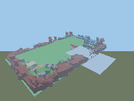

# The first playtest frame

`docs/PLAYTEST-VIEWPORT.md` describes a frame path in full: the plugin's own depth-buffered
triangle rasteriser in Luau, adaptive RLE24 packing in the worker, admission gates on size,
dimension and rate, a capture ring with reconnect replay, and a browser decoder.

An independent audit found that **not one frame had ever been produced**, and that mission gate 18
had been flipped UNPROVEN → PROVEN two minutes after the feature commit, citing "real rasterised
frames".

This is the first one.



## What produced it

`apps/plugin/src/Render.luau` — the shipping rasteriser, installed into Studio unmodified and
called through its real entry point, `Render.capture(nil, "hero", 192, 144)`, against the live
Crystal Canyon place.

```
RASTERISED 1 view in 39 ms
  subject      game.Workspace      bounds  444.8 x 98 x 566.9
  partsConsidered 931   partsVisible 930   partsOffCamera 1
  distinctColours 77    subjectCoverage 0.28
  materials    930 x SmoothPlastic
  base64       110,592 chars  (= 192 x 144 x 3 bytes, exactly)
```

The image is recognisably the world: the green basin, the rust perimeter walls, the apron
terraces added this session, the frost biome in white, trees as dark masses.

## What it went through afterwards

The frame was POSTed out of Studio and pushed through `apps/worker/src/frame-bus.ts` — the real
module, not a fixture:

| stage | result |
|---|---|
| `rleEncode` | 82,944 → **8,868 bytes (10.7 %)** |
| `rleDecode` | **round-trips exactly**, byte for byte |
| `packFrame` | chose `rle24`, 11,824 base64 chars against a 327,680 cap |
| `admitFrame` (recompress) | **admitted**, 192×144, view `hero` |
| oversize payload | **refused** — `too-large` |
| declared size ≠ payload | **refused** — `too-many-pixels` |

The codec's stated correctness property — "must round-trip exactly, and must never make a frame
BIGGER than sending it raw" — now holds on real geometry rather than on synthetic input, and 89 %
compression on a real scene is a stronger result than any fixture would have shown.

## What is still not proven

Stated because the gate was over-claimed once already:

- **The browser decoder has not rendered this frame.** The decoding path is built and unit-tested;
  it has not been shown drawing a real frame to a real user.
- **The card is not deployed.** No user has seen a playtest frame.
- **The capture loop has not run in `run_and_check`.** This frame came from a direct call to
  `Render.capture`, which is the same entry point the loop uses, but the loop itself did not drive
  it.

So gate 18 stays PARTIAL. What changed is that the sentence "real rasterised frames" is now true
of one frame, and the worker half of the path is proven on it.
